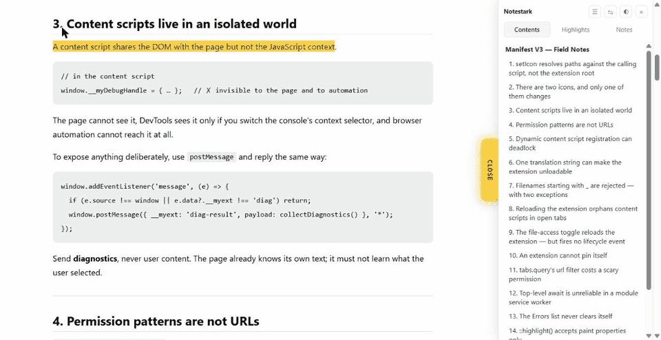
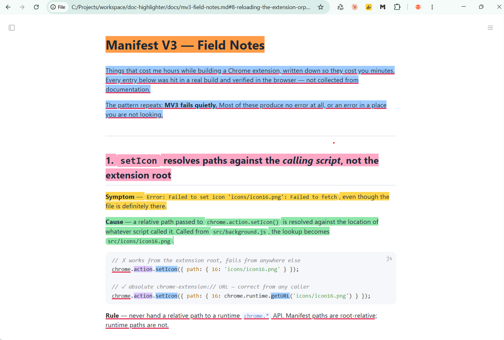
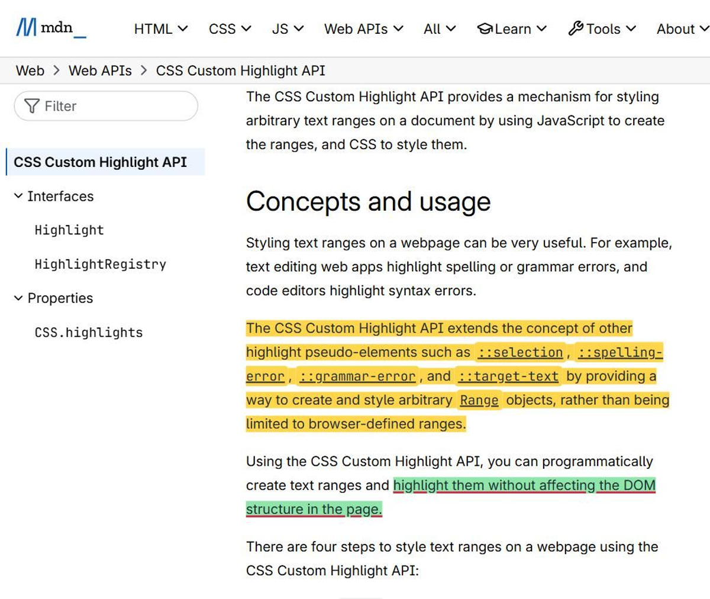

# Notestark

Highlight and underline text in local `.md` / `.html` files and on the web.
Your marks come back when you reopen the document.



*Select, colour, annotate — then reload. The marks are still there, and so is the note.*



*A local `.md` file opened straight from disk, rendered as a document rather than as a
wall of source, with its outline in the panel. Note the `file://` address: no server, no
upload, no account.*



*The same engine on the web, with every mark on the page listed in the panel. Inline
`code` chips are covered edge to edge — the highlight API paints text runs, so an
element's own padding needs filling separately.*

---

## What it is

A Chrome extension for people who read documentation in the browser and want to
mark it up the way they would mark up paper.

Select text → a small toolbar appears → pick a colour or an underline. The mark is
saved immediately and restored the next time you open that document.

**Six colours, plus underline — and they combine.** A passage can be yellow *and*
underlined. The palette can be changed, and the picker shows the contrast as you go.

**A navigator panel** docks to either edge: the document outline, every highlight, and
every note, on three tabs. Clicking a row scrolls to it and frames it briefly.

**Markdown rendered as a document.** A local `.md` file opens as headings, code blocks,
lists and tables instead of a wall of plain text, with one button back to the source.

**Sticky notes.** Write a note on any passage. A small dot marks it, and the note
opens where you left it.

**Translation, on your device.** Translate a passage with Chrome's built-in translator
and keep the result as a note. Nothing is sent to a translation service.

**A menu that remembers.** The toolbar popup lists what you marked recently, grouped by
site or by filename.

## What makes it different

**Local first. Nothing leaves your device.**
No account, no sign-in, no server, no network request anywhere in the codebase.
Highlights live in `chrome.storage.local`, which belongs to the extension — not in a
cookie (cookies are sent to the server on every request, and cap out around 4 KB) and
not in the page's `localStorage` (which the site itself can read and wipe, and which
"clear site data" destroys).

**It never changes the page structure.**
Painting uses the [CSS Custom Highlight API](https://developer.mozilla.org/en-US/docs/Web/API/CSS_Custom_Highlight_API)
instead of wrapping text in `<mark>` elements. No nested markup when a selection
crosses element boundaries, no collisions with SPA re-renders, and nothing extra lands
in text you copy.

One exception, kept as small as possible: inline elements such as `code` chips carry
their own padding, and that padding is not a text run, so the highlight API cannot
paint it — a fully selected line would show bare strips around every chip. Those
elements get a single styling attribute so the colour runs continuously. No element is
added, removed or re-parented.

Markdown preview is the other deliberate exception, and it is [explained below](#markdown-preview).

**Marks survive the document changing.**
Each highlight stores the exact text plus ~32 characters of context on either side.
When the document shifts, the anchor is relocated by matching that context. If the
text is gone entirely the highlight becomes an *orphan* — it is not deleted, and it
reappears if the text comes back.

**Works inside iframes.**
Some pages render their real content in a cross-origin iframe. Those are supported;
frames with fewer than 100 characters of text are skipped so ad and tracking frames
cost nothing.

## Install

On the **Chrome Web Store**, and runnable from source. This repository is usually ahead
of the published version — see [CHANGELOG.md](CHANGELOG.md).

To run it from source:

1. `git clone https://github.com/cansuk/doc-highlighter`
2. `npm install && npm run icons` — generates the PNG icon set
3. Open `chrome://extensions`, enable **Developer mode**
4. **Load unpacked** → select the **`extension/`** folder (not the repo root)

> The repo root contains `node_modules`, and Chrome refuses to load an unpacked
> extension containing files that start with `_`. Tooling therefore lives outside
> `extension/`.
>
> **The exception:** `_locales` and `_metadata` are Chrome's *own* reserved names and
> are allowed. The ban is on `_` names we invent, which is why `extension/_locales` is
> fine. See [field note 7](docs/mv3-field-notes.md).

If the icons are missing, Chrome fails the load — run `npm run icons` first.

### Enabling it where you need it

| Surface | How |
|---|---|
| **Local files** (`file://`) | `chrome://extensions` → Details → **Allow access to file URLs** |
| **All websites** | Toolbar icon → popup → **Enable on all sites** |
| **One website** | Toolbar icon → popup → **Enable on this site** |

`chrome://` pages, the Web Store and other extensions' pages cannot be reached —
Chrome blocks every extension there.

### Why the permission is a button, not an install warning

Web access is declared as `optional_host_permissions`, so **installing shows no
permission warning at all**. The permission is requested only when you click the
button, and can be revoked the same way.

The alternative — writing `host_permissions: ["*://*/*"]` into the manifest — would cost
two things:

- **"Read and change all your data on all websites"** at install time
- the **manual review queue** on the Chrome Web Store: weeks instead of days
  (see [PUBLISHING.md](PUBLISHING.md))

So the permission is behind a button. One click still enables every site; the outcome is
the same and it costs nothing.

**Revoking:** *Disable on all sites* in the popup, or `chrome://extensions → Site
access`. Note that individually granted sites are **not** removed when "all sites" is
switched off — Chrome keeps those as separate records, and each is turned off from its
own row.

Reading local files is the one permission the extension cannot ask for at all: that
toggle sits outside the Permissions API and only the user can flip it. That is why
there is an onboarding page — see [docs/onboarding.md](docs/onboarding.md).

## Usage

| Button | Action |
|---|---|
| 🟡 🟢 🩷 🔵 🟠 🟣 | Apply that colour |
| **U** | Underline |
| 💬 | Write a note on the passage |
| 文A | Translate the passage into the target language |
| ▾ | Choose a different target language |
| 🧽 | With text selected, clear that selection. With nothing selected, clear the **whole page** (two-step confirmation) |
| **×** | Close the toolbar |

Everything on the toolbar is also on the **right-click menu**, so it can be reached
without moving the pointer off the passage.

Colour and underline are independent — pressing one never clears the other. **Pressing
the same thing again removes it**; when nothing is left the highlight is deleted. The
toolbar marks the styles already applied with a white ring. `Esc` closes the toolbar.

Marking the same place twice does not create a duplicate: an overlap of 75% or more
counts as the same place, whether you reached it by clicking the existing highlight or
by selecting the text again.

A highlight is **saved immediately**. Reload the page, close the tab, close the browser —
it is there when you come back.

### Editing or removing an existing mark

Click **on** the highlight, without selecting anything. The toolbar opens:

- click another colour → the colour changes
- click the same colour or underline again → that style is removed
- when nothing is left → the highlight is deleted

### Clearing the page

With nothing selected, the eraser clears **every** highlight on the page. Because that
cannot be undone it is **two-step**: the first click turns the button red and asks
*"Delete 12?"*; the second applies it. It disarms itself after four seconds, or if you
press anything else.

A native `confirm()` is **not** used — a modal dialog locks the page, and that is bad
behaviour in a content script.

Clearing removes the storage **keys** as well, rather than leaving an empty record
behind.

### Older records migrate themselves

The model moved from a single `style` field to a `{ color, underline }` pair. Old
records are converted during `load()`. No data is lost and the migration is idempotent.
An unknown style — for example the deferred `bold` — is **not deleted**: it is not
painted, but it is kept, and it reappears on its own if that style comes back.

## The navigator panel

A collapsible panel docked to the left or right edge, with three tabs.

**Contents** is the document outline. It has two sources, because a local `.md` file
has *no headings in the DOM* — Chrome renders such a file as plain text inside a single
`<pre>`. So:

| Document | Outline comes from |
|---|---|
| HTML, or Markdown rendered by a viewer | real `<h1>`…`<h6>` elements |
| Raw `.md` / `.txt` opened from disk | `# ` syntax read out of the flattened text |

The raw case is the one that matters most here — reading local Markdown is the reason
this extension exists, and most people open those files with no viewer installed.

**Highlights** lists every mark in *document order*, not the order they were made — a
map that lists things in creation order is not a map. Orphans stay in the list, greyed
out and not clickable, because the text is not on the page right now. A row shows the
same swatch the page uses, so the list and the document speak one language.

**Notes** lists only the annotated passages, with the note text under each. It exists
because "what did I write about this document" is a different question from "what did I
mark", and answering it by scanning a list of every highlight is worse than having the
short list.

Clicking a row scrolls to the target and draws a frame around it for about a second.
That frame **cannot** be a `::highlight()` rule: the API ignores `border` and
`outline` entirely (see [field note 14](docs/mv3-field-notes.md)). It is a short-lived
absolutely positioned overlay, computed from `getClientRects()` and removed when the
animation ends — the page structure is still never modified.

**It reserves space, it does not cover the text.** The panel is `position: fixed`, so
without help it would sit on top of the document. Giving the document a margin on the
docked side shrinks its box while the panel stays at the viewport edge, and the two stop
overlapping.

Which element takes that margin has to be **measured, not assumed**. A margin on `html`
is dropped by the browser whenever the root element's width is not auto — the
declaration is over-constrained, and it goes with no error and no warning. So the rule
is written, read back, and swapped to `body` when the root refused it. Measured on MDN:
`html` computes to 0px there, `body` takes the full 332px.

The handle keeps its own 26px reserved even when the panel is closed, so nothing is ever
hidden behind it.

**The theme repaints the page, not just the panel.** `light` and `dark` inject a
stylesheet into the document itself; `auto` injects nothing and leaves the page exactly
as the site or Chrome rendered it. Theming is scoped to `html`/`body` and the elements
plain-text rendering actually produces — deep per-component theming is not attempted,
because that is a product of its own and a half-done version looks worse than none.
Highlight colours are unaffected either way: `::highlight()` paints its own background
and its own ink, so a yellow mark stays readable on a dark page.

The panel is **open by default**. Side, theme (auto / light / dark) and open state are
remembered in `chrome.storage.local`. The panel is built in the **top frame only**:
inside an iframe it would be trapped in the frame's box, and pages that embed their
content would end up with two of them.

## Markdown preview

Chrome shows a local `.md` file as a wall of plain text. Notestark renders it —
headings, code blocks, lists, tables, quotes — and one button in the panel switches back
to the source.

This is the one place the engine deliberately rewrites the document, and that is not a
contradiction. The "never touch the DOM" rule exists to stop **incidental** mutation from
breaking anchors. Switching view is not incidental: it is the user asking for a
different document, once, on purpose.

It does cost something, and the cost is already handled. Anchors are quotes and offsets
into the flattened text, and rendering changes that text — `## Title` becomes `Title`.
A mark that covered markdown syntax will not resolve in the rendered view. It is not
lost: orphans are kept and return when the view is switched off, which is the same
mechanism that already survives an edited document, reused rather than rebuilt.

**The renderer is ours.** Remote code is allowed by neither the CSP nor what was declared
to the store, and bundling one would double the package for the long tail of Markdown
that technical documents do not use. A `.md` file is untrusted input, so HTML is escaped
before anything else and link schemes are filtered — tested with a script tag, an inline
handler and a `javascript:` URL.

One defect the tests caught while this was built: hiding the source with `display:none`
left it in the index, because `buildIndex` walks text nodes and does not consult computed
style. The document was in the index **twice** and an anchor could resolve onto text
nobody can see. The source is detached now, not hidden.

## Sticky notes

A note belongs to a **highlight** rather than being its own object. The anchoring
system already exists, is tested, and relocates text when the document changes; a
second anchor system for standalone notes would buy nothing. So the record simply
grows a field:

```js
{ id, color, underline, note, noteOrigin, anchor: { exact, prefix, suffix, start, end }, createdAt }
```

Writing a note therefore creates a mark, which means a note can never be left floating
with nothing to attach to. The mark carries **no colour** — the dot is the indicator,
and you can colour the passage separately if you want to.

Two consequences fall out of that and both are enforced by tests:

- a mark that has only a note is **not deleted**, even though it has no colour and no
  underline (the rule that removes styleless marks had to learn about notes)
- clearing the note from a *coloured* mark leaves the mark alone

Nothing is inserted into the text. `::highlight()` cannot render an indicator and the
engine never mutates page structure, so the dot and the card are absolutely positioned
overlays inside **one** shadow layer — page CSS cannot reach them, and a single host
serves any number of notes. The dot sits just past the end of the passage; when a
highlight wraps, that is the last visual line, which is where a reader's eye ends up.

**The dot takes the colour of the mark it belongs to**, mixed towards the ink so it stays
visible on that colour — a marker on yellow text has to be darker than the yellow. The
mix is measured, not chosen: a first attempt landed at 2.70:1, under WCAG 1.4.11's 3:1
for a non-text UI component. A straight mix at 0.70 reaches 3.86:1.

**Origin is carried by the shape**, so it does not compete with colour for the same job:
a translation is a circle, a note you wrote keeps the folded corner of a sticky note.
Colour alone would have been a weak label — two dark cool tones are exactly the pair
colour vision deficiency flattens.

**A new dot pulses once** so a small mark is findable in a page of text. That is
0.67 Hz against a seizure threshold of three flashes per second, so it is far under it;
the criterion it did cross is WCAG 2.2.2 (Pause Stop Hide), which asks for a way to stop
motion lasting more than five seconds. The stagger is capped so the total is 4.9s, **and**
it is a setting, because motion is not only a seizure question. Default on;
`prefers-reduced-motion` wins without anyone having to find the switch.

Geometry access is total: if `getClientRects()` is unavailable or throws, the dot is
simply not drawn. It used to propagate out of `renderNoteDots()` and kill painting for
every highlight on the page — a rendering helper must never be able to take down the
anchoring pipeline.

## Translation

Press the language button and the selected passage is translated into your target
language, using **Chrome's built-in Translator**, on your own machine.

That is the only reason this feature exists. Sending a passage to a translation service
would break the promise the rest of the extension is built on, and would contradict both
the privacy policy and what was declared to the store.

The button on the toolbar shows the current target and translates on click; the caret
beside it opens a short target list, because that decision gets made next to the
passage. The full list is in the popup.

A translation can be **kept as a note** — a translation you want to keep *is* a note
about that passage. Notes made that way are marked differently from ones you wrote, so
you can always tell them apart.

No list of language names exists anywhere in this project. Codes are stored and
`Intl.DisplayNames` renders them in the reader's own language, so supporting thirty
languages cost no translation work and nothing can drift.

**Needs Chrome 138 or newer, on desktop.** Where it is unavailable the feature says so
rather than failing when pressed. The first time you translate between a pair of
languages, Chrome downloads a language model — that download is made by Chrome, carries
no page text, and never happens unless you press translate.

Every call is behind one function, so if the content script turns out to be the wrong
place to run the model, only that function moves.

## The menu — what you marked recently

Opening the toolbar popup shows what you marked, newest first, grouped by where you
marked it: the website, or the filename for a local document. Clicking a place opens it
again. Each group folds away, and everything marked in one place can be cleared from
there.

Nothing new is stored for this. The records are already keyed by document, so the list
reads them; a second list would only be something that could fall out of step. Times come
from `Intl.RelativeTimeFormat` and places from the URL, so nothing here needed
translating into either locale.

Clearing a place removes the hash index alongside the record. Left behind, that index
would let a renamed file resurrect a document that no longer exists. An open page follows
along: the content script clears itself when its own record is **removed** — removal
only, because it writes that key on every save and reacting to its own writes would loop.

The other tabs are the palette editor, the add-ons list, the motion setting, and About.

## How it works

```
selection ──▶ text index ──▶ anchor ──▶ chrome.storage.local
                  │            │
                  │            └─ exact + prefix(32) + suffix(32) + offset
                  └─ flattens the DOM to one string, maps offset ⇄ text node

page load ──▶ rebuild index ──▶ resolve anchors ──▶ CSS.highlights.set(...)
```

**Anchoring** follows the shape of the
[W3C Web Annotation](https://www.w3.org/TR/annotation-model/) selectors. Resolution
tries the stored offset first (cheapest), then searches every occurrence of the exact
text and scores candidates by prefix/suffix overlap and proximity to the old position.

**Re-anchoring** runs on a debounced `MutationObserver`, which matters when another
extension or an SPA rewrites the DOM after load.

### Where your data lives

`chrome.storage.local` — storage that belongs to the **extension**.

- **Not** a cookie. Cookies are sent to the server on every request and cap out near 4 KB
- **Not** the page's `localStorage`. Sites can read and wipe that, and "clear site data"
  destroys it
- Never leaves the machine. No server, no account, no network request
- Survives closing the tab and the browser; roughly 10 MB available

**Storage keys** differ by context, because what is stable differs:

```
top page   doc:<normalizedUrl>  → { url, contentHash, title, updatedAt, highlights[] }
           hash:<contentHash>   → <normalizedUrl>     // secondary index: file moved

iframe     doc:#<contentHash>                          // no URL index is written
```

**Why the key is inverted inside a frame.** Some pages render their content in a
cross-origin iframe — Claude artifacts do — and that frame's URL changes on every load:

```
.../?__frame_t=rxKnsYEOTV85xNjkfCgVSbsG.9627765b-…
```

If the URL were the primary key the highlights would vanish on every open and storage
would collect one dead record per load. In a frame the **content is stable and the URL is
volatile**; on a top page it is the other way round. So the content hash is primary
there.

Using the parent page's URL instead is **not possible** — a cross-origin frame cannot
read `top.location`.

**To delete everything:** `chrome://extensions` → Notestark → **Remove**. Removing the
extension takes all of its data with it. To delete one mark, click it and press **×**.

### If a highlight disappears

When the page content has changed the extension tries to **re-anchor**: it looks for the
text you marked plus roughly 32 characters around it. If the text is gone entirely it
cannot, and that state is called an **orphan**. It is written to the console:

```
[Notestark] N highlights could not be found on this page (orphan) — no data was deleted
```

**Nothing is deleted.** If the text comes back, so does the highlight.

### If you move or rename the file

The highlights follow. Records are indexed by **both** the URL and a **content hash**, so
a renamed file with the same content is found through the hash.

The reverse also holds: if the URL is the same but the content changed, the record is
found through the URL index and the highlights are re-anchored.

## Permissions, and why each one exists

| Permission | Why |
|---|---|
| `storage` | Keeps highlights on the device. Nothing is sent anywhere |
| `activeTab` | Reads only the active tab's URL, to show whether highlighting is available there |
| `scripting` | Registers the content script for sites you explicitly enable at runtime |
| `contextMenus` | Puts the same actions on the right-click menu, so they are reachable without leaving the passage. Limited to `file://` and http(s) pages |
| `file:///*` | The core use case: local documentation files. Chrome gates this behind its own switch, which the extension cannot flip |
| `*://*/*` *(optional)* | Requested only on your click, never at install time |

Copy-paste justification texts for the Web Store form are in
[PUBLISHING.md](PUBLISHING.md).

## Development

```bash
npm test             # 97 engine tests (jsdom) — no browser required
npm run check:i18n   # locale parity + Chrome message-syntax validation
npm run check:colors # palette contrast + colour-blind separation
npm run icons        # regenerate the icon set
npm run promo        # regenerate the store promo tiles
npm run pack         # runs all checks, then builds dist/<name>-<version>.zip
```

### Tests

Tests execute the **real `content.js`** inside jsdom with `chrome.*` stubs — not a
copy, not a reimplementation. They cover the text index, offset↔range conversion,
cross-element selections, anchor drift, picking the right occurrence of repeated text,
orphan behaviour, URL normalisation, the colour/underline combination, migration of
older records, overlap detection, clearing, the note flow, timestamp formats, the
accessibility thresholds read out of the source, and the panel's space reservation.

Not covered (needs a real browser): Custom Highlight API rendering, real mouse
selection, `chrome.scripting` registration, permission flows. Those are verified by
hand — the protocol is [docs/manual-test.md](docs/manual-test.md).

### Diagnostics

Off by default, so the console stays clean. The informational logs were not deleted,
only silenced: diagnosing a persistence failure is not possible without them.

```js
__docHL.setDebug(true)     // in the page console, then reload
self.docHL.setDebug(true)  // in the service worker console
__docHL.dump()             // always prints: keys, hash, anchor resolution table
```

`console.error` and warnings the user needs to see — for example *"the extension was
reloaded, refresh the page"* — are **always** on. Those are not diagnostics, they are
real faults.

There are no silent `catch` blocks in the extension code. An empty one hid a `setIcon`
bug for three rounds; it surfaced the moment a log was added.

### Packaging

```bash
npm run pack      # dist/notestark-<version>.zip
```

Zips the contents of `extension/` only, with `manifest.json` at the root of the archive.
`node_modules`, `tools/`, `assets/` and `store/` are excluded. On Windows it uses
PowerShell's `Compress-Archive`, so there is no extra npm dependency.

`prepack` runs the i18n, colour and engine checks first, so a broken package cannot be
produced.

### Directory structure

```
doc-highlighter/
  extension/                 <- LOAD UNPACKED POINTS HERE
    _locales/en|tr/          messages.json — translations
    manifest.json
    icons/                   generated PNGs (npm run icons)
    src/
      background.js          service worker — lifecycle, icon/badge, message routing,
                             context menu
      shared/access.js       file-permission read/write, chrome:// redirect
      shared/sites.js        website permissions, dynamic content script registration
      shared/i18n.js         t() and localizeDom()
      onboarding/            setup page (state + steps + live verification)
      popup/                 the menu — Recent, palette, add-ons, motion, About
      content/content.js     the engine: index, anchoring, painting, panel, notes,
                             markdown preview, translation
  tools/
    build-icons.mjs          SVG -> PNG generation, config driven
    build-promo.mjs          store promo tiles
    build-privacy-md.mjs     PRIVACY.md generated from site/privacy.html
    check-i18n.mjs           locale parity
    check-colors.mjs         palette contrast and separation
    shot.mjs                 store screenshots, captured from a live browser
    capture-window.ps1       the Windows half of shot.mjs
    test-engine.mjs          the engine test suite
    pack.mjs                 store zip
  docs/                      field notes, manual test, onboarding, icons, i18n
  icon.config.json           icon settings (preset, glyph, colours, variants)
  test-pages/                sample.html · sample.md — test fixtures
  assets/                    generated SVG sources + glyph cache + _preview.png
  site/                      the public pages behind the store's homepage/privacy links
  store/                     listing text, screenshots and promo tiles
  NOTICE                     third-party licences (Lucide, ISC)
```

## Known limits

- **Chrome 105+** required (CSS Custom Highlight API). Below that, an error is written
  to the console and nothing is painted. Chrome refuses to install it at all since
  0.8.1, via `minimum_chrome_version`.
- **Translation needs Chrome 138+, on desktop.** Elsewhere the feature reports that it
  is unavailable instead of failing when pressed.
- **The badge and icon do not update while the service worker is asleep.** Turn the file
  permission off and the icon can stay yellow until the worker next wakes. The popup is
  always live and always correct.
- **Weak persistence in some SPAs.** Applications that rewrite the URL via
  `pushState` after load can end up keyed under the pre-navigation URL. Normal pages and
  iframe content are unaffected — measured. Fixing it means watching for URL changes and
  refreshing the key; not done yet.
- **Tags and search do not exist yet.** Notes do.
- **Highlights are sharp-cornered rectangles, by design.** Rounded corners and padding
  would require wrapping the text in a real element — exactly what this engine avoids.
  Measured: `::highlight()` parses `border-radius` and `padding` into the CSSOM and then
  ignores both at paint time. See [field note 14](docs/mv3-field-notes.md).

### Bold is on hold

There was a **B** button. It is commented out — it did not work well enough, and a
different approach is needed.

**Why it is hard:** `font-weight` is not supported by the CSS Custom Highlight API.
`::highlight()` accepts paint properties only (`color`, `background-color`,
`text-decoration`, `text-shadow`, `-webkit-text-stroke`); `font-weight` was left out of
the spec because it would force reflow.

**Tried:** `-webkit-text-stroke-width: 0.7px` as a faux-bold. It did not produce the
result wanted.

**Alternatives still open** — the full list is in the `BOLD IS ON HOLD` note in
`src/content/content.js`: faux-bold via `text-shadow`, a combination of both at low
values, emphasis through a contrasting background instead of weight, or DOM wrapping
(`<strong>` — real bold, rejected because it breaks page structure).

**No data is lost.** A highlight already saved with `bold` is not deleted, only not
painted. If bold returns, it appears again on its own.

## Documentation

| Document | What is in it |
|---|---|
| [CHANGELOG.md](CHANGELOG.md) | Every version and what it brought |
| [docs/mv3-field-notes.md](docs/mv3-field-notes.md) | The Manifest V3 traps that cost hours here — silent permission filters, deadlocked script registration, a translation string that made the extension unloadable, the two icons only one of which changes. Every entry was hit in this build and verified in the browser |
| [docs/manual-test.md](docs/manual-test.md) | The step-by-step installation and permission test, with what you should see at each step |
| [docs/onboarding.md](docs/onboarding.md) | Why an onboarding page is necessary, the flow, and how state stays correct |
| [docs/icon-pipeline.md](docs/icon-pipeline.md) | How the icon set is generated and why every size is rendered natively |
| [docs/i18n.md](docs/i18n.md) | How translation works, how the language is chosen, and why there is no language picker |
| [PUBLISHING.md](PUBLISHING.md) | Chrome Web Store steps, permission justification texts, and the Safari porting analysis |
| [PRIVACY.md](PRIVACY.md) | The privacy policy, generated from the published page |

## Roadmap

**Stage 1 — Chrome ✅** Local `.md` / `.html` plus any website. Engine, persistence,
panel, notes, translation, i18n, permission flow, icon pipeline. Published.

**Stage 2 — Safari 🔜** The same codebase with a separate permission layer. Roughly 70%
ports unchanged — anchoring, the storage schema, the toolbar, i18n, rendering — because
it is all plain DOM and JS, and Safari accepts both `browser.*` and `chrome.*`. The
permission layer (`access.js`, `sites.js`) is rewritten: Safari's model is entirely
different and has no equivalent of "Allow access to file URLs".

**The question to answer before writing any of it:** *does Safari give extensions access
to local `.md` / `.html` files at all?* If it does not, the product's core use case does
not work there and the port has no point. Full analysis, including the untested API list
and the cost (Apple Developer Program at \$99/year, plus a Mac), is in
[PUBLISHING.md § Safari](PUBLISHING.md).

**Not scheduled:** bold (see above), tags on a highlight, an "all my highlights" screen
across documents (which needs IndexedDB rather than `chrome.storage.local`, for
cross-document queries), and export to Markdown or JSON.

## Privacy

Nothing is collected and nothing is transmitted — see [PRIVACY.md](PRIVACY.md).

## License

[GPL-3.0](LICENSE) — see [NOTICE](NOTICE) for third-party attributions
(the icons derive from [Lucide](https://lucide.dev), ISC).
